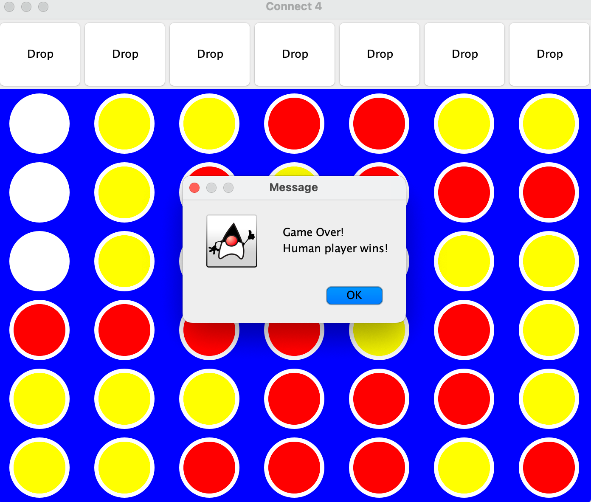

# ConnectFour game in Java

This is a simple implementation of the ConnectFour game in Java which allows to practice the principles of
object-oriented programming. 

The game is played between two players, a human player and a "smart" robot.

The interface was created using ```javax.swing``` and ```java.awt``` libraries.

## How to play
The interface includes the 6x7 board with "Drop" buttons on top of each column
which allow the human player to drop its token in a column.

The aim of the game is to connect four tokens either vertically, horizontally or diagonally.



## Additional documentation
This project has also been documented with a post on Medium which can be found [here](https://medium.com/).

